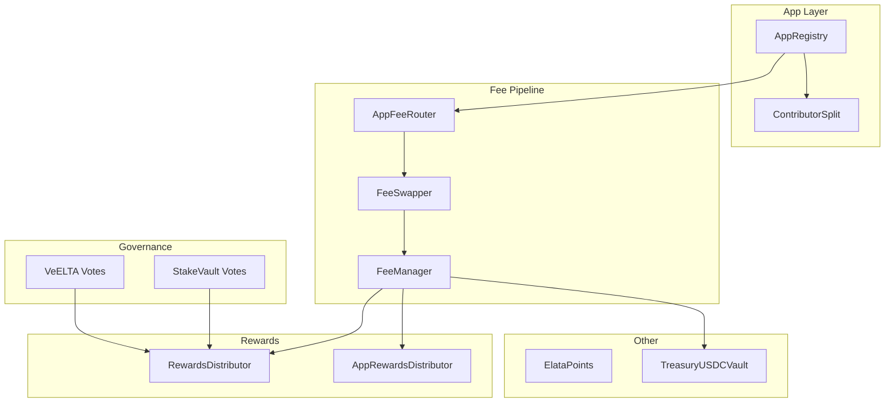

## Overview

The Elata protocol is composed of modular smart contracts deployed on Ethereum and Sepolia. This reference documents the public interfaces for the current protocol stack.

---

## Contract Map

| Contract | Purpose | Category |
|---|---|---|
| **AppRegistry** | Canonical app ownership and contributor-split mapping | Core |
| **ContributorSplit** | Pull-based contributor payout accounting | Core |
| **AppFeeRouter** | Routes fees from apps to protocol destinations | Fees |
| **FeeSwapper** | Swaps collected fee tokens before distribution | Fees |
| **FeeManager** | Fee accounting buckets by app, kind, and asset | Fees |
| **RewardsDistributor** | Protocol-level reward distribution to stakers | Rewards |
| **AppRewardsDistributor** | Per-app reward distribution to token holders | Rewards |
| **VeELTA Votes** | Vote-escrowed ELTA governance power | Governance |
| **StakeVault Votes** | Staking vault voting weight | Governance |
| **ElataPoints** | Non-transferable participation reputation | Reputation |
| **TreasuryUSDCVault** | USDC treasury custody | Treasury |

---

## Architecture

---

## Networks

| Network | Status |
|---|---|
| Ethereum mainnet | Production |
| Sepolia | Testnet |

For deployed addresses, see [Resources → Smart Contracts](/resources/smart-contracts).

---

## Source Code

All contracts are open source:

- [elata-protocol](https://github.com/elata-biosciences/elata-protocol) — Solidity source and deployment scripts
