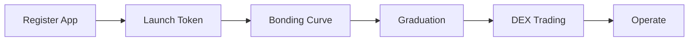

## Overview

Every Elata app follows the same lifecycle: register, launch a token, trade on a bonding curve, graduate to a DEX pair, and operate with full community tools.

---

## Phase A: Registration

Register your app by calling `AppFactory` with metadata and a Safe wallet address.

- **Cost:** 10 ELTA registration fee
- **What happens:** App appears in the store immediately (without a token)
- **Requirements:** A Safe multisig wallet to control the app

Your app exists on-chain and is visible in the app store, but has no token yet.

---

## Phase B: Token Launch

Deploy the full token stack by sending 100 ELTA as the bonding curve seed.

- **Cost:** 100 ELTA seed (total with registration: 110 ELTA)
- **What gets deployed:** App Token (10M supply), Bonding Curve, Staking Vault, Vesting Wallet, Ecosystem Vault

**Token distribution:**

| Destination | Share | Amount |
| --- | --- | --- |
| Bonding curve | 50% | 5,000,000 tokens |
| Team vesting | 25% | 2,500,000 tokens |
| Ecosystem vault | 25% | 2,500,000 tokens |

After deployment, the bonding curve enters `PENDING` state.

---

## Bonding Curve

Once activated, the curve enters `ACTIVE` state and trading begins.

**How it works:**
- Constant-product formula: `reserveELTA * reserveToken = k`
- Price rises as more ELTA is deposited; falls as tokens are sold back
- 1% trading fee on each trade (configurable by governance)

**Early access:** For the first 6 hours, buyers need 100 XP to participate. This prevents sniping.

**Lifecycle states:**

| State | Description |
| --- | --- |
| `PENDING` | Deployed, not yet activated |
| `ACTIVE` | Trading is live |
| `GRADUATED` | Reserves hit the graduation threshold |
| `CANCELLED` | App cancelled before graduation |

---

## Graduation

Graduation triggers when ELTA reserves in the bonding curve reach **42,000 ELTA**.

When graduation happens:

<Steps>
  <Step title="Liquidity pair created">
    Remaining tokens and ELTA reserves are paired on a DEX.
  </Step>
  <Step title="LP tokens locked">
    The liquidity position is locked for **730 days** (2 years).
  </Step>
  <Step title="Trading shifts">
    All trading moves from the bonding curve to the DEX pair.
  </Step>
</Steps>

---

## Post-Graduation

After graduation, your app token trades freely on the DEX. The protocol continues to handle:

- **Fee routing** through the FeeRouter
- **Transfer tax** (up to 2%, LP-keyed)
- **Contributor payouts** via the ContributorSplit contract
- **Community tools** (tournaments, items, staking)

---

## Next

<CardGroup cols={3}>
  <Card title="Launch Requirements" icon="clipboard-check" iconType="light" href="/apps/build/launch-requirements">
    What you need to launch
  </Card>
  <Card title="Bonding Curve Basics" icon="chart-line" iconType="light" href="/apps/design/bonding-curve-basics">
    Price discovery mechanics
  </Card>
  <Card title="App Tokens" icon="coins" iconType="light" href="/apps/design/app-tokens">
    Token design and distribution
  </Card>
</CardGroup>
