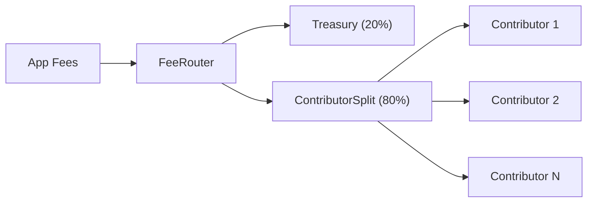

## Contributor Splits

Each app has a ContributorSplit contract controlled by the app's Safe. This is the mechanism for distributing app revenue to team members and contributors.



**Key properties:**
- Pull-based: contributors claim their share, the protocol does not push payments
- Managed exclusively by the app's Safe (add, remove, or adjust share percentages)
- Supports up to 150-200 contributors per app
- Default split: 80% to contributors, 20% to protocol treasury (adjustable via governance)

<Note>
  Contributors must actively claim their payouts. Unclaimed funds remain in the contract until withdrawn.
</Note>

---

## veELTA and Governance

veELTA is the vote-escrow mechanism for protocol governance. Users lock ELTA tokens for a chosen duration and receive voting power in return.

| Parameter | Value |
| --- | --- |
| Lock duration | 7 to 730 days |
| Voting power boost | 1x (7 days) to 2x (730 days), linear |
| Fee yield | None (V2 design) |

**Boost formula:**

```
boost = 1 + (lockDuration / maxDuration)
veELTA = lockedAmount * boost
```

veELTA is used exclusively for governance voting. It does not entitle holders to fee yields. This design choice mitigates securities risk under the Howey test.

**Position management:** create a lock, increase the locked amount, extend the duration, or unlock the principal after expiry.

---

## Protocol-Level Decisions

Governance proposals are submitted through the ElataGovernor contract and executed via the ElataTimelock. Changes to protocol parameters (fee splits, graduation thresholds, trading fees) require governance approval.

Key parameters controlled by governance:

| Parameter | Default | Range |
| --- | --- | --- |
| Trading fee | 1% | Governance-set |
| Transfer tax cap | 2% | Protocol-wide maximum |
| Treasury take | 20% | Adjustable |
| Graduation threshold | 42,000 ELTA | Governance-set |
| LP lock duration | 730 days | Governance-set |

---

## Next

<CardGroup cols={2}>
  <Card title="Fee Flow for Apps" icon="route" iconType="light" href="/apps/design/fee-flow">
    How fees are routed
  </Card>
  <Card title="veELTA and Governance" icon="scale-balanced" iconType="light" href="/apps/users/veelta-governance">
    User guide for locking ELTA
  </Card>
</CardGroup>
