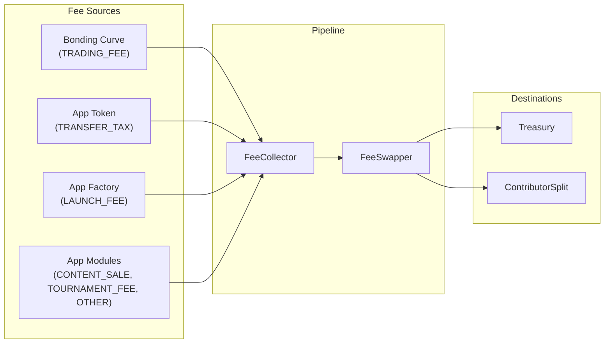
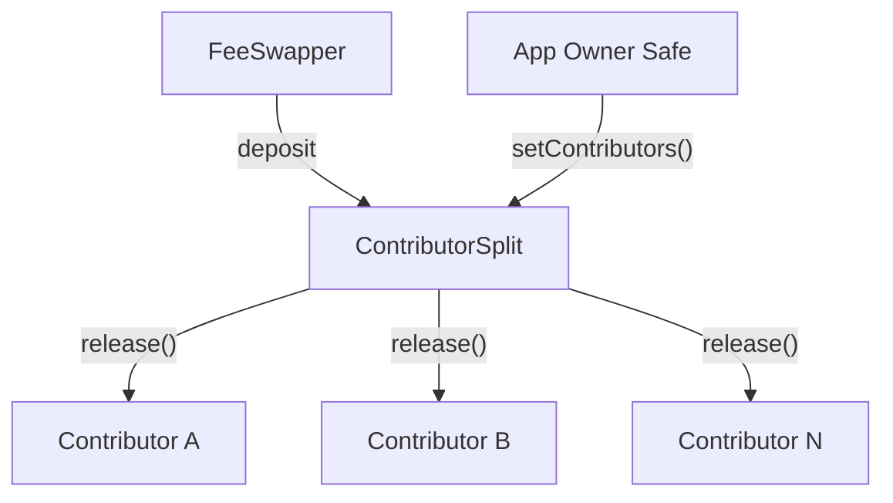

## Overview

All protocol and app fees flow through the same contracts but are routed differently based on their `FeeKind`.

---

## FeeKind Routing

Every fee is tagged with a `FeeKind` that determines where it goes:

| FeeKind | Routing |
| --- | --- |
| `LAUNCH_FEE` | 100% treasury |
| `TRADING_FEE` | 80% contributors / 20% treasury |
| `TRANSFER_TAX` | 80% contributors / 20% treasury |
| `CONTENT_SALE` | 80% contributors / 20% treasury |
| `TOURNAMENT_FEE` | 80% contributors / 20% treasury |
| `OTHER` | 80% contributors / 20% treasury |

Default treasury take: **20%** (2000 bps), configurable per-app by governance.

---

## FeeCollector

The accounting layer. It tracks pending fee balances indexed by `(appId, FeeKind, asset)`.

- Receives ELTA deposits via `depositElta(appId, kind, amount)`
- Receives app token deposits for transfer tax
- Sweeps accumulated balances to FeeSwapper via `sweep(appId, kind, asset)`
- Sweeping is permissionless (anyone can trigger it)

---

## FeeSwapper

The routing layer (implements `IFeeRouterV2`):

1. If the app is **paused** in AppRegistry, 100% goes to treasury
2. If the fee kind is `LAUNCH_FEE`, 100% goes to treasury
3. Otherwise: treasury gets its take, the rest goes to ContributorSplit

<Note>
  Contributors receive their share through pull-based claims, not automatic distribution. They must actively claim their payouts from the ContributorSplit contract.
</Note>

---

## ContributorSplit

Each app has a ContributorSplit contract deployed at registration:

- **Shares-based:** each contributor has a share weight; payouts are proportional
- **Max 200 contributors** (factory default, governance-configurable)
- **Pull claims:** contributors call `release(asset, account)` to withdraw
- **Owner Safe controlled:** only the app's Safe can modify contributors

---

## Next

<CardGroup cols={3}>
  <Card title="Bonding Curve Basics" icon="chart-line" iconType="light" href="/apps/design/bonding-curve-basics">
    Price discovery mechanics
  </Card>
  <Card title="Community Systems" icon="users" iconType="light" href="/apps/design/community-systems">
    Governance and contributor splits
  </Card>
  <Card title="App Tokens" icon="coins" iconType="light" href="/apps/design/app-tokens">
    Token design and distribution
  </Card>
</CardGroup>
