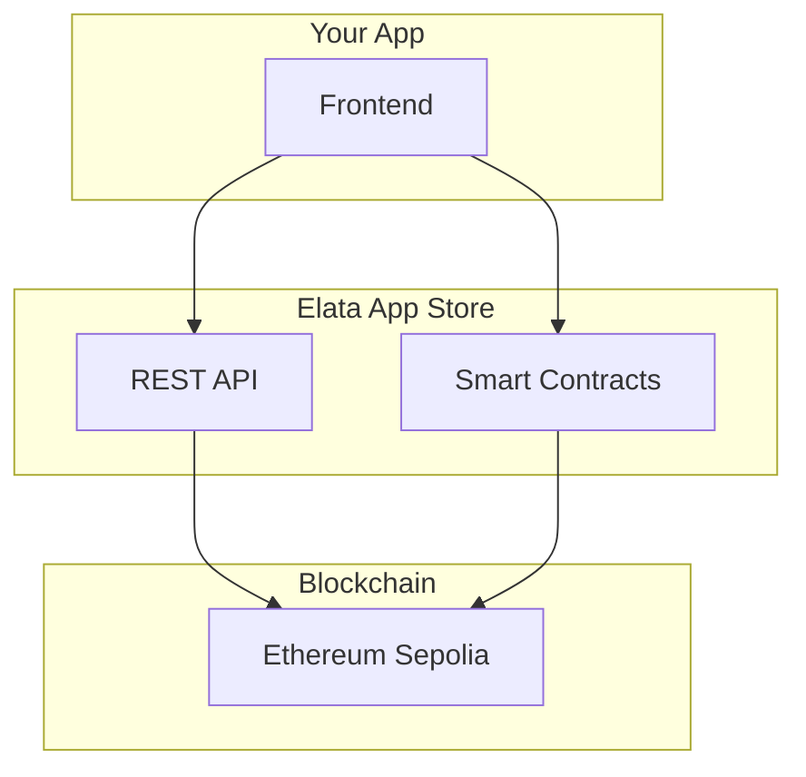

## Overview

Three ways to integrate: embed in the App Store iframe, hit the REST API, or talk to contracts directly. For full code, see [GitHub](https://github.com/elata-biosciences).

---

## Architecture



### Integration Options

| Method              | Use Case                      | Complexity |
| ------------------- | ----------------------------- | ---------- |
| **App Store Embed** | Run app in Elata iframe       | Low        |
| **REST API**        | Read app data, metadata       | Medium     |
| **Smart Contracts** | Direct blockchain interaction | High       |

---

## App Store API

The App Store provides REST endpoints for reading data.

### Base URL

```
https://app.elata.bio/api
```

### Endpoints

#### Get All Apps

```bash
GET /api/apps
```

Returns list of all apps with metadata:

```json
{
  "apps": [
    {
      "id": "...",
      "tokenAddress": "0x...",
      "name": "NeuroPong",
      "symbol": "NPONG",
      "description": "...",
      "imageUrl": "...",
      "creator": "0x...",
      "status": "raising" | "live",
      "createdAt": "2024-01-01T00:00:00Z"
    }
  ]
}
```

#### Get Single App

```bash
GET /api/apps/{tokenAddress}
```

Returns detailed app information including:

- Basic metadata
- Social links
- Team members
- Artifacts (game files)

#### Get Prices

```bash
GET /api/prices
```

Returns current ELTA price data for UI display.

---

## Smart Contracts

For direct blockchain interaction, these are the key contracts:

### Core Contracts

| Contract            | Purpose               |
| ------------------- | --------------------- |
| **ELTA**            | Main protocol token   |
| **VeELTA**          | Vote-escrowed staking |
| **AppFactory**      | Creates new apps      |
| **AppFactoryViews** | Read app data         |

### Per-App Contracts

| Contract               | Purpose                          |
| ---------------------- | -------------------------------- |
| **AppToken**           | Individual app ERC-20 token      |
| **AppBondingCurve**    | Price discovery via ELTA curve   |
| **AppVestingWallet**   | 25% supply — cliff + linear vest |
| **AppEcosystemVault**  | 25% supply — admin-controlled    |
| **FeeCollector**       | Collects and routes protocol fees |

### Contract Addresses

See [Resources → Contracts](/resources/smart-contracts) for deployed addresses.

---

## Reading On-Chain Data

### Using wagmi/viem (Recommended)

```typescript
import { createPublicClient, http } from 'viem'
import { baseSepolia } from 'viem/chains' // Use 'base' for mainnet

const client = createPublicClient({
  chain: baseSepolia,
  transport: http()
})

// Read app data from factory
const appData = await client.readContract({
  address: APP_FACTORY_ADDRESS,
  abi: AppFactoryABI,
  functionName: 'apps',
  args: [appId]
})
```

### Key Read Functions

| Contract        | Function             | Returns                                        |
| --------------- | -------------------- | ---------------------------------------------- |
| AppFactory        | `apps(uint256)`      | App tuple (creator, token, curve, etc.)  |
| AppFactory        | `appCount()`         | Total apps launched                      |
| AppToken          | `balanceOf(address)` | User token balance                       |
| AppBondingCurve   | `getPrice()`         | Current curve price                      |
| AppVestingWallet  | `releasable()`       | Vested tokens available to release       |
| AppEcosystemVault | `balance()`          | Vault token balance                      |
| VeELTA            | `balanceOf(address)` | User veELTA balance                      |

---

## Writing Transactions

### App Launch (Two-Phase)

```typescript
import { writeContract } from 'wagmi'

// Phase 1 — register the app (no token yet)
await writeContract({
  address: APP_FACTORY_ADDRESS,
  abi: AppFactoryABI,
  functionName: 'createAppWithoutToken',
  args: [name, symbol, description, imageUrl, website]
})

// Phase 2 — approve ELTA and launch the token + bonding curve
await writeContract({
  address: ELTA_ADDRESS,
  abi: ERC20ABI,
  functionName: 'approve',
  args: [APP_FACTORY_ADDRESS, 110n * 10n**18n]
})

await writeContract({
  address: APP_FACTORY_ADDRESS,
  abi: AppFactoryABI,
  functionName: 'launchTokenForApp',
  args: [appId]
})
```

### Buy on Bonding Curve

```typescript
// Approve ELTA for curve
await writeContract({
  address: ELTA_ADDRESS,
  abi: ERC20ABI,
  functionName: 'approve',
  args: [CURVE_ADDRESS, amount]
})

// Buy tokens
await writeContract({
  address: CURVE_ADDRESS,
  abi: AppBondingCurveABI,
  functionName: 'buy',
  args: [eltaAmount, minTokensOut]
})
```

### Lock ELTA as veELTA

```typescript
// Approve ELTA for the VeELTA contract
await writeContract({
  address: ELTA_ADDRESS,
  abi: ERC20ABI,
  functionName: 'approve',
  args: [VEELTA_ADDRESS, amount]
})

// Lock ELTA (unlockTime is a Unix timestamp)
await writeContract({
  address: VEELTA_ADDRESS,
  abi: VeELTAABI,
  functionName: 'lock',
  args: [amount, unlockTime]
})
```

---

## Embedding in Iframe

Apps run inside an iframe on the Elata App Store. Your app can:

### Communicate with Parent

```javascript
// Send message to Elata frame
window.parent.postMessage({
  type: 'ELATA_EVENT',
  payload: { action: 'SCORE_UPDATE', score: 1000 }
}, '*')

// Listen for messages from Elata
window.addEventListener('message', (event) => {
  if (event.data.type === 'ELATA_USER') {
    const { address, balance } = event.data.payload
    // Use user data
  }
})
```

### Access User Data

When embedded, your app receives:

- Connected wallet address
- App token balance
- veELTA balance

---

## Webhooks (Coming Soon)

Future webhook support for:

- New token purchases
- Fee collection events

---

## SDKs & Libraries

### Elata Bio SDK

| Package | Purpose | Docs |
|---------|---------|------|
| `@elata-biosciences/eeg-web` | EEG signal processing via WASM | [SDK — eeg-web](/sdk/eeg-web/getting-started) |
| `@elata-biosciences/eeg-web-ble` | Web Bluetooth headband connection | [SDK — eeg-web-ble](/sdk/eeg-web-ble/getting-started) |
| `@elata-biosciences/rppg-web` | Camera-based heart rate (rPPG) | [SDK — rppg-web](/sdk/rppg-web/getting-started) |

See the full [SDK documentation](/sdk/overview) for installation, architecture, and integration guides.

### App Store Source

Use the App Store codebase as an integration reference:

- [elata-appstore](https://github.com/elata-biosciences/elata-appstore) — Frontend code
- [elata-protocol](https://github.com/elata-biosciences/elata-protocol) — Smart contracts

```typescript
// Useful hooks from elata-appstore/src/hooks/
useAppFactory()      // App creation and data
useBondingCurve()    // Price quotes, buy/sell
useAppHoldings()     // User balances
useVeELTA()          // veELTA locking
```

---

## ABIs

Contract ABIs are available in the App Store repository:

```
elata-appstore/src/abi/
├── AppFactory.json
├── AppBondingCurve.json
├── AppToken.json
├── AppVestingWallet.json
├── AppEcosystemVault.json
├── FeeCollector.json
├── ELTA.json
├── VeELTA.json
└── ...
```

---

## Rate Limits

### API Limits

| Endpoint       | Limit       |
| -------------- | ----------- |
| Read endpoints | 100 req/min |
| Heavy queries  | 10 req/min  |

### RPC Limits

Use your own RPC provider for production:

- [Alchemy](https://alchemy.com)
- [Infura](https://infura.io)
- [QuickNode](https://quicknode.com)

---

## Example: Price Display Widget

```typescript
import { useReadContract } from 'wagmi'
import { formatEther } from 'viem'

function PriceWidget({ curveAddress }) {
  const { data: price } = useReadContract({
    address: curveAddress,
    abi: AppBondingCurveABI,
    functionName: 'getPrice',
  })
  
  return (
    <div>
      Current Price: {price ? formatEther(price) : '...'} ELTA
    </div>
  )
}
```

---

## Resources

<CardGroup cols={2}>
  <Card title="App Store Repo" icon="github" href="https://github.com/elata-biosciences/elata-appstore">
    Frontend implementation reference
  </Card>
  <Card title="Protocol Repo" icon="github" href="https://github.com/elata-biosciences/elata-protocol">
    Smart contract source code
  </Card>
  <Card title="Contract Addresses" icon="file-contract" iconType="light" href="/resources/smart-contracts">
    Deployed contract addresses
  </Card>
  <Card title="Discord" icon="discord" iconType="light" href="https://discord.gg/GqS9CstffK">
    Developer support channel
  </Card>
</CardGroup>