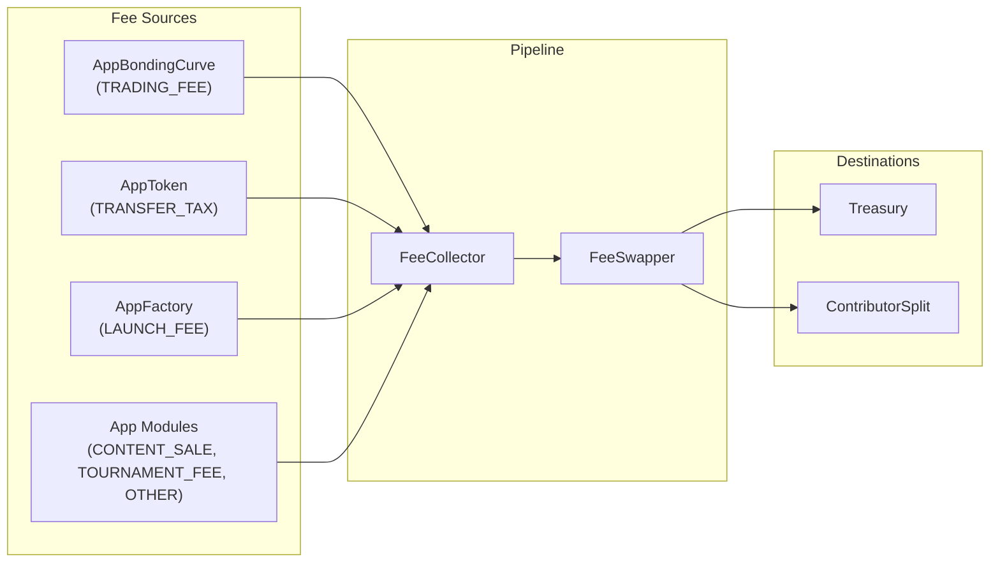
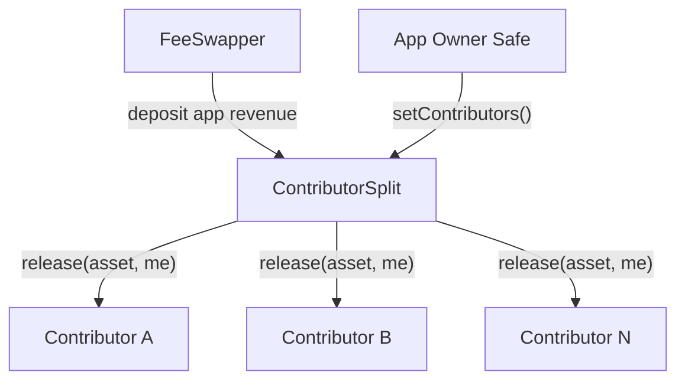

## Overview

The protocol uses a two-step fee pipeline with explicit fee-kind routing. All protocol and app fees flow through the same contracts, but are routed differently based on their `FeeKind`.

---

## FeeKind Enum

Every fee is tagged with a `FeeKind` that determines routing:

| FeeKind | Value | Routing |
|---------|-------|---------|
| `LAUNCH_FEE` | 0 | 100% treasury |
| `TRADING_FEE` | 1 | 80% contributors / 20% treasury |
| `TRANSFER_TAX` | 2 | 80% contributors / 20% treasury |
| `CONTENT_SALE` | 3 | 80% contributors / 20% treasury |
| `TOURNAMENT_FEE` | 4 | 80% contributors / 20% treasury |
| `OTHER` | 5 | 80% contributors / 20% treasury |

The default treasury take for app-revenue fee kinds is `2000 bps` (20%), configurable per-app by governance.

---

## FeeCollector

`FeeCollector` is the accounting layer. It tracks pending fee balances indexed by `(appId, FeeKind, asset)`.

**Key behavior:**
- Receives ELTA deposits via `depositElta(appId, kind, amount)`
- Receives app token deposits for transfer tax
- Sweeps accumulated balances to `FeeSwapper` via `sweep(appId, kind, asset)`
- Sweeping is permissionless — anyone can trigger it

---

## FeeSwapper

`FeeSwapper` (implementing `IFeeRouterV2`) applies the routing policy:

1. If the app is **paused** in `AppRegistry` → 100% treasury
2. If the fee kind is `LAUNCH_FEE` → 100% treasury
3. Otherwise (app-revenue kinds):
   - `treasuryAmount = amount * takeBps / 10_000`
   - `contributorAmount = amount - treasuryAmount`
   - Treasury portion is sent to the protocol treasury
   - Contributor portion is forwarded to the app's `ContributorSplit`

**Defaults:**
- `defaultTreasuryTakeBps`: 2000 (20%)
- Per-app override via `appTreasuryTakeBps[appId]` (if non-zero)
- `minSwapThreshold`: 1 ELTA (minimum for swap operations)

---

## ContributorSplit

Each app has a `ContributorSplit` contract deployed at registration. It implements pull-based payouts to named contributors.

- **Shares-based**: each contributor has a share weight; payouts are proportional
- **Max 200 contributors** (factory default, governance-configurable)
- **Pull claims**: contributors call `release(asset, account)` to claim
- **Locked on first payment**: contributor list is locked once the first non-zero payment is received
- **Owner safe controlled**: only the app's owner safe can set contributors via `setContributors()`

---

## FeeManager (Epoch Settlement)

`FeeManager` provides an alternative epoch-based settlement flow with USDC conversion:

- Epochs are time-bounded settlement windows (default 1 day, configurable 1 hour to 7 days)
- Caller incentive: 0.10% of USDC balance (max 25 USDC) when balance exceeds 100 USDC
- Settles accumulated fees by swapping to USDC and depositing into `TreasuryUSDCVault`
- Tracks per-app and per-epoch revenue

**FeeManager splits** (separate from FeeSwapper routing):

| Recipient | Default bps |
|-----------|-------------|
| App stakers | 4500 (45%) |
| veELTA holders | 3000 (30%) |
| Creator | 1000 (10%) |
| Treasury | 1000 (10%) |
| Referral | 500 (5%) |

<Note>
  `FeeManager` splits and `FeeSwapper` routing are parallel systems. The active fee path depends on deployment configuration. Consult deployment artifacts for which pipeline is active in your environment.
</Note>

---

## TreasuryUSDCVault

Holds USDC for the protocol treasury when epoch settlement is active:

- Receives deposits from `FeeManager` with `deposit(appId, amount, epochId)`
- Tracks `totalRevenue`, `revenueByApp[appId]`, `revenueByEpoch[epochId]`
- Only the treasury multisig can withdraw
