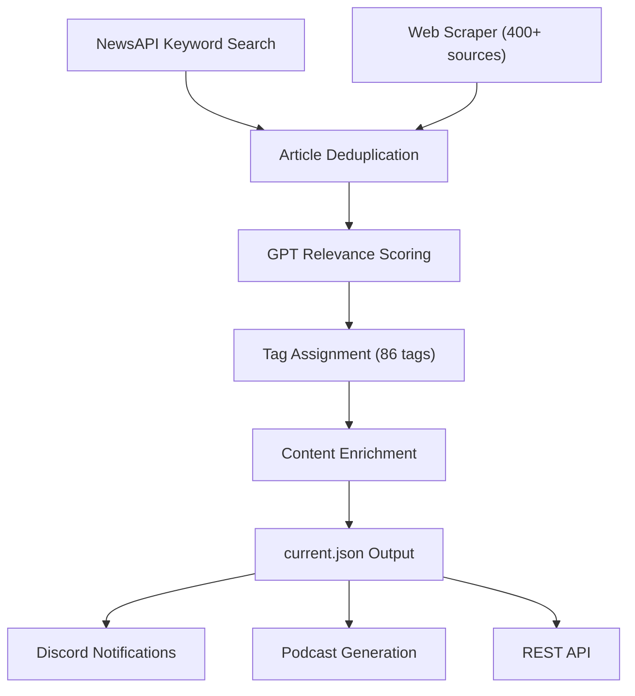

## System Architecture

The Newsreader is composed of three modules:

```
elata-vsm-system-4/
├── scraper/         # AI-powered news aggregation engine
├── web/             # Next.js frontend
└── shared-types/    # Zod schemas and shared TypeScript types
```

---

## Scraper Pipeline

The scraper runs as a scheduled process via PM2. Each cycle executes the following pipeline:



### Phase 1: Aggregation

- **NewsAPI** queries for neuroscience, psychiatry, BCI, DeSci, and related keywords
- **Web scraper** fetches from 400+ curated sources: journals, preprint servers, pharma outlets, neurotech companies, regulatory agencies, and community platforms

### Phase 2: Analysis

- **GPT processor** evaluates each article against the Elata mission and assigns a relevance score (0-1)
- **GPT validator** filters out low-quality or irrelevant content
- **Tag assignment** applies from a controlled vocabulary of 86 domain-specific tags across categories: neuroscience, hardware, AI/ML, pharmacology, biohacking, biomarkers, DeSci, and industry

### Phase 3: Enrichment and Output

- **Content scraper** extracts full text, word count, and reading time
- **Embedding generation** via OpenAI for semantic search
- **Podcast generation** produces AI-narrated audio summaries using ElevenLabs with two narrator personas (Nova and Dr. Renn)
- **Discord notifications** alert the community to high-relevance articles
- Results are written to `current.json` and served via the REST API

---

## Data Model

Articles follow a Zod-validated schema:

```typescript
const ArticleSchema = z.object({
  id: z.string(),
  title: z.string(),
  url: z.string(),
  source: z.string(),
  description: z.string(),
  summary: z.string().optional(),
  tags: z.array(NewsTagSchema).default([]),
  relevanceScore: z.number(),
  author: z.string().optional(),
  publishedAt: z.string().optional(),
  scrapedAt: z.string(),
  sourceType: z.enum(["newsapi", "scrape", "twitter", "reddit", "community"]).optional(),
  embedding: z.array(z.number()).optional(),
  // ... additional fields
});
```

Summary metadata tracks aggregate statistics:

```typescript
const SummaryMetadataSchema = z.object({
  totalArticles: z.number(),
  dateRange: z.object({ from: z.string(), to: z.string() }),
  tagCounts: z.record(z.string(), z.number()),
  sourceCounts: z.record(z.string(), z.number()),
});
```

---

## Tag Taxonomy

The 86 tags are organized into domains:

| Domain | Tag count | Examples |
|--------|-----------|---------|
| Neuroscience & Research | 15 | `eeg`, `fmri`, `neuroimaging`, `synaptic-plasticity` |
| Hardware & Devices | 16 | `bci`, `neural-interfaces`, `openbci`, `muse`, `eeg-headsets` |
| Computational & AI | 12 | `precision-psychiatry`, `machine-learning`, `neural-decoding` |
| Neuro-Pharmacology | 8 | `neuropharmacology`, `clinical-trials`, `drug-discovery` |
| Biohacking & Experimental | 12 | `nootropics`, `psychedelics`, `neurofeedback`, `meditation` |
| Biomarkers & Mechanisms | 10 | `biomarkers`, `neuroinflammation`, `gut-brain-axis` |
| DeSci & Web3 | 7 | `desci`, `daos`, `tokenomics`, `on-chain-governance` |
| Industry & Business | 6 | `pharma`, `biotech`, `startups`, `regulatory` |

---

## Running Locally

```bash
git clone https://github.com/Elata-Biosciences/elata-vsm-system-4.git
cd elata-vsm-system-4
```

See the individual module READMEs for setup:
- [Scraper setup](https://github.com/Elata-Biosciences/elata-vsm-system-4/tree/main/scraper)
- [Web platform setup](https://github.com/Elata-Biosciences/elata-vsm-system-4/tree/main/web)
