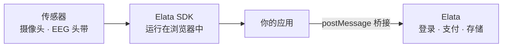

<Note>
  本页英文版本已更新，中文翻译将随后同步。最新内容请参阅[英文版本](/overview/ecosystem-map)。
</Note>

## 三个层次

1. **传感器**：用于 rPPG 的网络摄像头，或 Muse 等蓝牙 EEG/PPG 头带。
2. **Elata SDK**：在用户设备上借助 WebAssembly，把原始传感器数据转化为可用信号（心率、频段功率、HRV）。
3. **Elata**：在沙箱中托管你的应用，并提供账户、支付、存储和分发。

---

## 开发者流程

1. **构建**：使用 SDK 构建 Web 应用。可通过 `npm create @elata-biosciences/elata-demo` 从模板开始。
2. **注册**：在 Elata 的“构建应用”向导中注册应用名称。
3. **上传**：上传构建产物的 zip 文件，Elata 会立即进行检查。
4. **提交**审核：自动安全扫描和人工审核员会审查该版本。
5. **上线**：用户发现你的应用并在浏览器中使用。

详情见[应用生命周期](/cn/apps/app-lifecycle)。

---

## 你的应用如何运行

你的应用运行在一个拥有独立源的沙箱 iframe 中。在用户许可下，它可以使用摄像头和蓝牙，但无法看到用户的身份、钱包或 Elata 的数据。

当需要平台能力时，它会向 Elata 发送消息：

| 需求 | Elata 功能 |
| --- | --- |
| 出售解锁内容 | [应用内购买](/cn/apps/platform/in-app-purchases) |
| 保存进度 | [应用状态](/cn/apps/platform/app-state) |
| 记录会话和分数 | [指标与分数](/cn/apps/platform/metrics-and-scores) |
| 为用户评分做贡献 | [同意与洞察](/cn/apps/platform/consent-and-insights) |
| 提醒用户 | [通知](/cn/apps/platform/notifications) |
| 按月收费 | [订阅](/cn/apps/platform/subscriptions) |

---

## 数据存放在哪里

| 数据 | 存放位置 |
| --- | --- |
| 原始摄像头画面和生物信号 | 用户的设备上 |
| 你的应用保存的存档、记录和分数 | 用户账户中，仅限你的应用访问 |
| 用于评分的派生会话结果 | 仅在用户同意后与 Elata 共享 |

参见[隐私与数据](/cn/overview/privacy-and-consent)。
