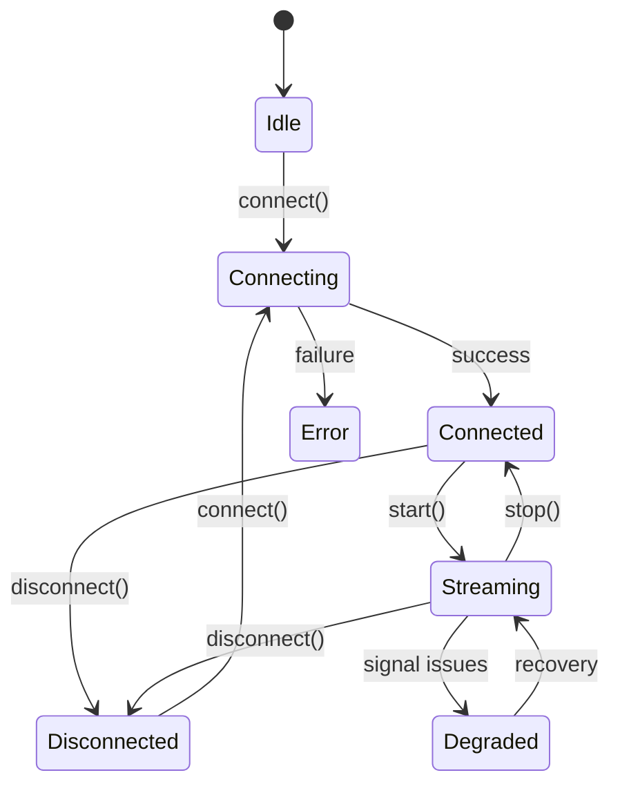

## HeadbandFrameV1

The canonical data frame emitted by all headband transports. Every implementation (BLE, native bridge, synthetic) produces this same shape:

```typescript
interface HeadbandFrameV1 {
  schemaVersion: "v1";
  source: string;                        // e.g., "muse-ble"
  sequenceId: number;
  emittedAtMs: number;
  eeg: HeadbandSignalBlock;              // always present
  ppgRaw?: HeadbandSignalBlock;          // PPG (if available)
  optics?: HeadbandSignalBlock;          // Athena optics
  accgyro?: HeadbandSignalBlock;         // Athena accelerometer/gyroscope
  battery?: HeadbandBatteryBlock;        // battery level
}
```

---

## HeadbandSignalBlock

A block of time-series samples for one or more channels:

```typescript
interface HeadbandSignalBlock {
  sampleRateHz: number;
  channelNames: string[];                // e.g., ["TP9", "AF7", "AF8", "TP10"]
  channelCount: number;
  samples: number[][];                   // rows of [ch0, ch1, ch2, ch3]
  timestampsMs?: number[];
  clockSource?: "device" | "local";
}
```

---

## HeadbandTransportState

Transport lifecycle states:

| State | Description |
|-------|-------------|
| `Idle` | Transport created, not connected |
| `Connecting` | Connection in progress |
| `Connected` | Connected, not streaming |
| `Streaming` | Actively receiving frames |
| `Degraded` | Connected but experiencing issues |
| `Reconnecting` | Attempting to reconnect |
| `Disconnected` | Disconnected from device |
| `Error` | Unrecoverable error |

---

## HeadbandTransport Interface

All transports implement this interface:

```typescript
interface HeadbandTransport {
  onFrame?: (frame: HeadbandFrameV1) => void;
  onStatus?: (status: HeadbandTransportStatus) => void;
  connect(): Promise<void>;
  disconnect(): Promise<void>;
  start(): Promise<void>;
  stop(): Promise<void>;
}
```

**Lifecycle:**



---

## HeadbandTransportStatus

Status updates emitted via `onStatus`:

```typescript
interface HeadbandTransportStatus {
  state: HeadbandTransportState;
  atMs: number;
  reason?: string;
  errorCode?: string;
  recoverable?: boolean;
  details?: Record<string, unknown>;
}
```

---

## Usage Pattern

```typescript
const transport: HeadbandTransport = /* BleTransport or other */;

transport.onFrame = (frame) => {
  const eegSamples = frame.eeg.samples;
  // Process each row: [tp9, af7, af8, tp10]
};

transport.onStatus = (status) => {
  console.log(`State: ${status.state}`, status.reason);
};

await transport.connect();
await transport.start();

// ... later
await transport.stop();
await transport.disconnect();
```
