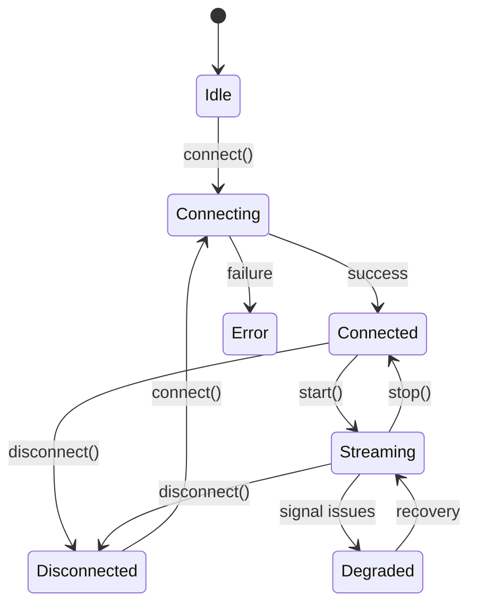

## HeadbandFrameV1

所有头带传输输出的标准数据帧。每种实现（BLE、原生桥接、合成数据）都输出相同的结构：

```typescript
interface HeadbandFrameV1 {
  schemaVersion: "v1";
  source: string;                        // 例如 "muse-ble"
  sequenceId: number;
  emittedAtMs: number;
  eeg: HeadbandSignalBlock;              // 始终存在
  ppgRaw?: HeadbandSignalBlock;          // PPG（如有）
  optics?: HeadbandSignalBlock;          // Athena 光学传感器
  accgyro?: HeadbandSignalBlock;         // Athena 加速度计/陀螺仪
  battery?: HeadbandBatteryBlock;        // 电量
}
```

---

## HeadbandSignalBlock

一个或多个通道的时间序列样本块：

```typescript
interface HeadbandSignalBlock {
  sampleRateHz: number;
  channelNames: string[];                // 例如 ["TP9", "AF7", "AF8", "TP10"]
  channelCount: number;
  samples: number[][];                   // 行：[ch0, ch1, ch2, ch3]
  timestampsMs?: number[];
  clockSource?: "device" | "local";
}
```

---

## HeadbandTransportState

传输生命周期状态。`HeadbandTransportState` 是字符串枚举：`HeadbandTransportState.Streaming === "streaming"`。

| 状态 | 说明 |
|-------|-------------|
| `Idle` | 已创建传输，未连接 |
| `Connecting` | 正在连接 |
| `Connected` | 已连接，未输出数据 |
| `Streaming` | 正在接收数据帧 |
| `Degraded` | 已连接，但存在问题 |
| `Reconnecting` | 正在尝试重连 |
| `Disconnected` | 已与设备断开 |
| `Error` | 不可恢复的错误 |

---

## HeadbandTransport 接口

所有传输都实现此接口：

```typescript
interface HeadbandTransport {
  onFrame?: (frame: HeadbandFrameV1) => void;
  onStatus?: (status: HeadbandTransportStatus) => void;
  connect(): Promise<void>;
  disconnect(): Promise<void>;
  start(): Promise<void>;
  stop(): Promise<void>;
}
```

**生命周期：**


```mermaid
stateDiagram-v2
    [*] --> Idle
    Idle --> Connecting: connect()
    Connecting --> Connected: success
    Connected --> Streaming: start()
    Streaming --> Connected: stop()
    Connected --> Disconnected: disconnect()
    Streaming --> Disconnected: disconnect()
    Connecting --> Error: failure
    Streaming --> Degraded: signal issues
    Degraded --> Streaming: recovery
    Disconnected --> Connecting: connect()
```

---

## HeadbandTransportStatus

通过 `onStatus` 输出的状态更新：

```typescript
interface HeadbandTransportStatus {
  state: HeadbandTransportState;
  atMs: number;
  reason?: string;
  errorCode?: string;
  recoverable?: boolean;
  details?: Record<string, unknown>;
}
```

---

## 用法

```typescript
const transport: HeadbandTransport = /* BleTransport 或其他传输 */;

transport.onFrame = (frame) => {
  const eegSamples = frame.eeg.samples;
  // samples[sampleIdx][channelIdx]：每行一个时间步 [tp9, af7, af8, tp10]
};

transport.onStatus = (status) => {
  console.log(`State: ${status.state}`, status.reason);
};

await transport.connect();
await transport.start();

// ……之后
await transport.stop();
await transport.disconnect();
```

---

## 辅助函数

`@elata-biosciences/eeg-web` 提供用于重组帧数据的辅助函数：

| 辅助函数 | 返回 |
| --- | --- |
| `getEegChannelSamples(frame, channelIndex)` | 单个通道的 `Float32Array`，可直接用于 `band_powers` |
| `getEegInterleavedSamples(frame)` | 交错排列的所有通道 `[s0_ch0, s0_ch1, …]`，用于 `WasmCalmnessModel` 等模型 |
| `getEegSignalBlock(frame, source?)` | 原始或处理后的 EEG 块 |

---

## 下一步

<CardGroup cols={2}>
  <Card title="EEG BLE 快速上手" icon="bluetooth" href="/cn/sdk/eeg-web-ble/getting-started">
    连接头带设备
  </Card>
  <Card title="EEG + BLE 集成" icon="link" href="/cn/sdk/guides/eeg-ble-integration">
    端到端数据流指南
  </Card>
</CardGroup>
