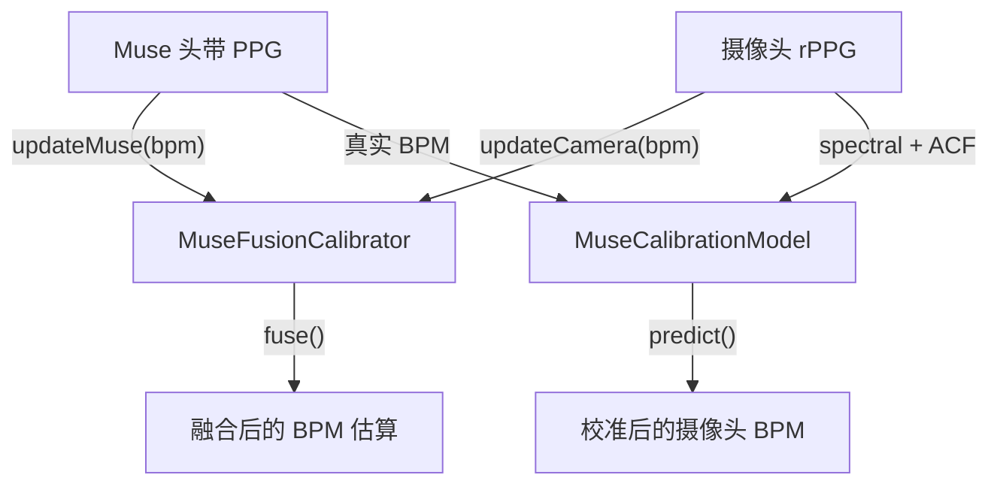

## 概述

当 Muse 头带的 PPG 与基于摄像头的 rPPG 同时可用时，SDK 支持**传感器融合**：以接触式 PPG 为参考，校准并改进基于摄像头的心率估算。

---

## MuseFusionCalibrator

将 Muse PPG 读数与摄像头 rPPG 估算融合，以提高准确性：

```typescript
import { RppgProcessor, MuseFusionCalibrator, loadWasmBackend } from "@elata-biosciences/rppg-web";

const backend = await loadWasmBackend(); // 无法加载打包的 WASM 时返回 null
if (!backend) throw new Error("rPPG WASM backend unavailable");
const processor = new RppgProcessor(backend, 30);
const calibrator = new MuseFusionCalibrator();

// 输入 Muse PPG 读数（来自头带）
calibrator.updateMuse(museBpm, quality, timestampMs);

// 输入摄像头 rPPG 读数
calibrator.updateCamera(cameraBpm, cameraQuality, timestampMs);

// 获取融合结果
const fused = calibrator.fuse(cameraBpm, cameraQuality, timestampMs);
```

`RppgProcessor` 也内置了 Muse 集成：

```typescript
processor.updateMuseMetrics(museBpm, quality, timestampMs);
```

---

## MuseCalibrationModel

一个简单的回归模型，随时间学习摄像头 BPM 与接触式 BPM 之间的关系：

```typescript
import { MuseCalibrationModel } from "@elata-biosciences/rppg-web";

const model = new MuseCalibrationModel();

// 使用成对观测值训练
model.train(spectralBpm, acfBpm, trueBpm);

// 检查是否已收集足够数据
if (model.isTrained()) {
  const predictedBpm = model.predict(spectralBpm, acfBpm);
}

// 持久化
const snapshot = model.getSnapshot();
model.loadSnapshot(snapshot);
model.reset();
```

---

## BPM 证据类型

处理器从多种分析方法中生成证据：

```typescript
type BpmEvidenceSource = "backend" | "spectral" | "acf" | "peaks" | "calibrated";

type BpmEvidence = {
  source: BpmEvidenceSource;
  bpm: number;
  confidence: number;
};

type BpmResolutionResult = {
  bpm: number | null;
  confidence: number;
  winningSources: BpmEvidenceSource[];
  aliasFlag: boolean;
  debug: { /* 候选项、历史中位数、胜出项 */ };
};

type FusionSource = "camera" | "muse" | "blend" | "none";
```

---

## Muse PPG 滤波

对 PPG 样本应用 Muse 风格的带通滤波：

```typescript
import { museStyleFilter } from "@elata-biosciences/rppg-web";

const filtered = museStyleFilter(ppgSamples, sampleRate);
```

---

## 校准流程



1. 从仅使用摄像头的 rPPG 开始
2. 当 Muse 头带连接后，将其 PPG 作为真实值输入
3. 校准模型学习摄像头与接触式之间的映射关系
4. 训练完成后，使用学到的模型校正仅摄像头的估算
5. 融合校准器结合两种来源，以获得最高准确性

---

## 下一步

<CardGroup cols={2}>
  <Card title="帧来源" icon="camera" href="/cn/sdk/rppg-web/frame-sources">
    摄像头采集和人脸检测
  </Card>
  <Card title="rPPG 摄像头集成" icon="video" href="/cn/sdk/guides/rppg-camera">
    端到端网络摄像头流水线
  </Card>
</CardGroup>
