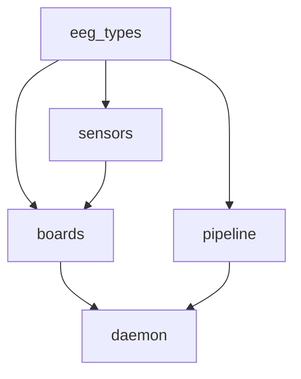
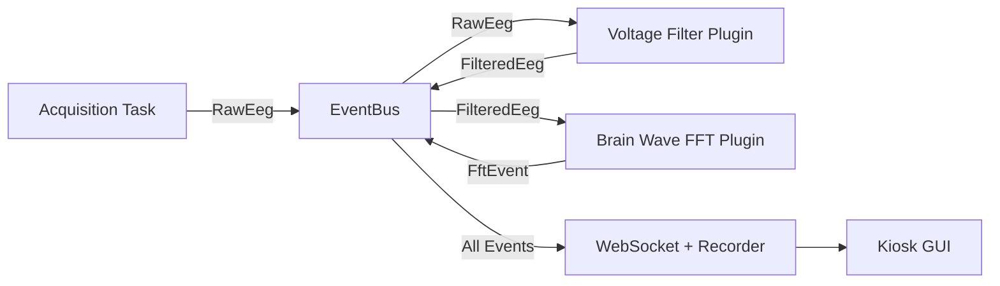

## Crate Architecture

The firmware is a Rust workspace split into five crates with strict layering. No circular dependencies.



| Crate         | Owns                                                                    | Depends On                  |
| ------------- | ----------------------------------------------------------------------- | --------------------------- |
| **eeg_types** | `Packet`, `ChannelId`, `AdcConfig`, error enums                         | —                           |
| **sensors**   | Register maps, low-level SPI/I2C for a single chip                      | eeg_types                   |
| **boards**    | Glue that unites one or more chips into a PCB driver (`impl EegDriver`) | sensors, eeg_types          |
| **pipeline**  | DSP graph, processing stages, sinks                                     | eeg_types                   |
| **daemon**    | CLI, config, picks a board driver and pumps packets into the pipeline   | boards, pipeline, eeg_types |

The daemon is the only binary crate. Everything else is a library.

---

## Plugin System

Plugins are event-driven and run in parallel across CPU cores. Each plugin is a separate Rust crate in the `plugins/` directory.



### Writing a Plugin

Every plugin implements the `EegPlugin` trait:

```rust
#[async_trait]
impl EegPlugin for MyPlugin {
    fn name(&self) -> &'static str { "my_plugin" }
    fn clone_box(&self) -> Box<dyn EegPlugin> { Box::new(self.clone()) }

    async fn run(
        &mut self,
        bus: Arc<dyn EventBus>,
        mut receiver: broadcast::Receiver<SensorEvent>,
        shutdown_token: CancellationToken,
    ) -> Result<()> {
        loop {
            tokio::select! {
                biased;
                _ = shutdown_token.cancelled() => break,
                Ok(event) = receiver.recv() => {
                    // process event, then broadcast results back to bus
                }
            }
        }
        Ok(())
    }
}
```

Plugins can optionally declare an `event_filter` to subscribe only to relevant event types, avoiding unnecessary wake-ups.

### Included Plugins

| Plugin                 | Purpose                                    |
| ---------------------- | ------------------------------------------ |
| `basic_voltage_filter` | Voltage scaling and filtering              |
| `brain_waves_fft`      | FFT spectral decomposition with browser UI |
| `csv_recorder`         | Record sessions to CSV files               |

---

## WebSocket API

The daemon exposes a centralized WebSocket endpoint for real-time data streaming with a topic-based pub/sub model.

**Endpoint:** `ws://localhost:9000/ws/data`

### Subscribe to a Topic

```json
{ "type": "subscribe", "topic": "eeg_voltage", "epoch": 1 }
```

### Unsubscribe

```json
{ "type": "unsubscribe", "topic": "eeg_voltage" }
```

Data frames are binary (`RtPacket` format) for high-performance streaming. A single client can hold multiple topic subscriptions simultaneously.

### Control Plane (REST + SSE)

In addition to the WebSocket data plane, the daemon provides HTTP endpoints on the same port:

| Endpoint                      | Method | Purpose                                     |
| ----------------------------- | ------ | ------------------------------------------- |
| `/api/pipelines`              | GET    | List available pipeline definitions         |
| `/api/pipelines/{id}/start`   | POST   | Start a pipeline                            |
| `/api/pipeline/stop`          | POST   | Stop the running pipeline                   |
| `/api/state`                  | GET    | Current runtime configuration snapshot      |
| `/api/events`                 | GET    | SSE stream of state updates                 |
| `/api/pipelines/{id}/control` | POST   | Send runtime commands (e.g. `SetParameter`) |

---

## Board Configurations

### V1: Single ADS1299

One ADS1299 EVM connected directly to the Pi 5 via SPI. Provides 8 channels with buffered reference (SRB1) and fixed internal bias drive.

| SPI Signal  | ADS1299 Pin (J3) | Pi 5 Pin        |
| ----------- | ---------------- | --------------- |
| CS          | Pin 1            | Pin 24 (CE0)    |
| SCLK        | Pin 3            | Pin 23          |
| MOSI (DIN)  | Pin 11           | Pin 19          |
| MISO (DOUT) | Pin 13           | Pin 21          |
| DRDY        | Pin 15           | Pin 22 (GPIO25) |

### V2: Four Synchronized ADS1299 Boards

Star topology with one master board and three secondaries sharing clock, MOSI, SCLK, and MISO. Each board has a dedicated chip-select and DRDY line. Only the master board (Board 0) drives the bias electrode.

| Signal             | Pi 5 Pin        | Notes                  |
| ------------------ | --------------- | ---------------------- |
| CS_A (Board 0)     | Pin 24 (CE0)    | Hardware CS            |
| CS_B (Board 1)     | Pin 26 (CE1)    | Hardware CS            |
| CS_C (Board 2)     | Pin 29 (GPIO5)  | Software CS            |
| CS_D (Board 3)     | Pin 31 (GPIO6)  | Software CS            |
| START (all boards) | Pin 15 (GPIO22) | Sync pulse             |
| DRDY (Board 0)     | Pin 22 (GPIO25) | Falling-edge interrupt |

---

## Next

<CardGroup cols={2}>
  <Card icon="brain" href="/home/elata-eeg/elata-eeg-overview" title="EEG Overview">
    Hardware BOM and quickstart
  </Card>
  <Card icon="bluetooth" href="/sdk/eeg-web-ble/getting-started" title="SDK: EEG Web">
    Connect to EEG headbands over Web Bluetooth
  </Card>
</CardGroup>