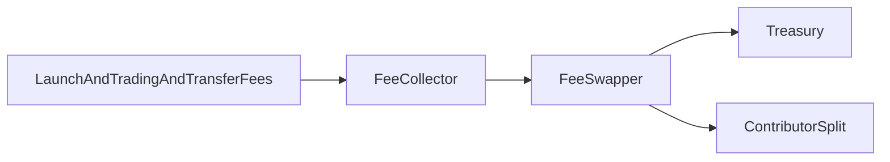

## Architecture

Three practical layers:

1. **Launch layer**: `AppFactory`, `AppRegistry`, `AppBondingCurve`, `AppToken`
2. **Fee layer**: `FeeCollector`, `FeeSwapper`, `ContributorSplit`
3. **Governance layer**: `ELTA`, `VeELTA`, `ElataPoints`, governor/timelock/config

---

## App Lifecycle

1. Register app and contributor split.
2. Launch token stack (`10,000,000` app supply).
3. Run active curve distribution (`x*y=k`).
4. Graduate to LP at target/deadline.
5. Continue app-level fee routing post-graduation.

---

## Fee Flow

Routing policy:

- launch fee -> treasury
- app-revenue fee kinds -> contributors + treasury (default `80/20`)
- paused app -> treasury

For full details on fee kinds, routing, and configuration, see the [Fee Flow for Apps](/apps/design/fee-flow) reference.

---

## XP and veELTA

- XP gates early buys during launch windows (default `100 XP`, `6h`).
- veELTA provides time-weighted voting power via ELTA locks (`7-730` days, `1x-2x` boost).

---

## Security Posture

- fixed ELTA supply (`77,000,000`)
- explicit curve lifecycle states
- LP lock on graduation
- explicit fee-kind taxonomy
- per-app fee accounting (no unbounded global sweeps)
