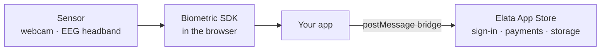

## Three layers

```mermaid
graph LR
    A[Sensor<br/>webcam · EEG headband] --> B[Biometric SDK<br/>in the browser]
    B --> C[Your app]
    C -->|postMessage bridge| D[Elata App Store<br/>sign-in · payments · storage]
```

1. **Sensors.** A webcam for rPPG, or a Bluetooth EEG/PPG headband such as Muse.
2. **Biometric SDKs.** Packages that turn raw sensor data into usable signals (heart rate, band powers, HRV) on the user's device, using WebAssembly.
3. **The App Store.** Hosts your app in a sandbox and provides accounts, payments, storage, and distribution.

---

## The builder flow

1. **Build** a web app with the SDKs. Start from a template with `npm create @elata-biosciences/elata-demo`.
2. **Register** your app name in the store's Build an App wizard.
3. **Upload** a zip of your build. The store checks it immediately.
4. **Submit** for review. An automated security scan and a moderator review the release.
5. **Go live.** Users find your app and play it in their browser.

Details: [App Lifecycle](/apps/app-lifecycle).

---

## How your app runs

Your app runs inside a sandboxed iframe on its own origin. It can use the
camera and Bluetooth (with the user's permission), but it can't see the user's
identity, wallet, or the store's data.

When it needs the platform, it sends a message to the store:

| Need | Store feature |
| --- | --- |
| Sell an unlock | [In-app purchases](/apps/platform/in-app-purchases) |
| Save progress | [App state](/apps/platform/app-state) |
| Track sessions and scores | [Metrics and scores](/apps/platform/metrics-and-scores) |
| Contribute to the user's Score | [Consent and insights](/apps/platform/consent-and-insights) |
| Remind the user | [Notifications](/apps/platform/notifications) |
| Charge monthly | [Subscriptions](/apps/platform/subscriptions) |

---

## Where data lives

| Data | Where it stays |
| --- | --- |
| Raw camera frames and biosignals | On the user's device |
| Saves, records, and scores your app stores | The user's account, scoped to your app |
| Derived session results for the Score | Shared with Elata only with the user's consent |

See [Privacy and data](/learn/privacy-and-data).
