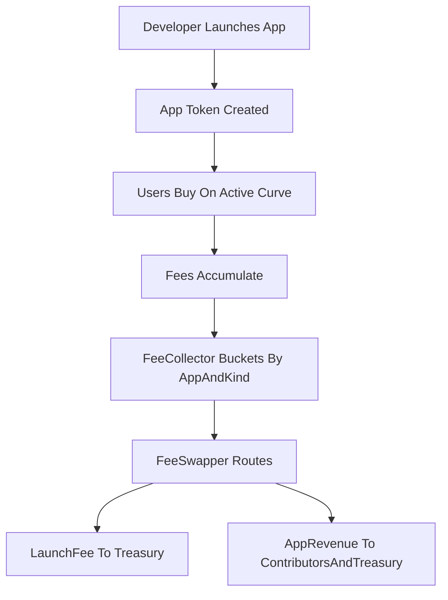

## Overview

Elata is a permissionless app-launch protocol. Builders register an app, launch an app token, and distribute it on a constant-product ELTA bonding curve.

<Info>
  **Network**: Live on **Ethereum Sepolia** (testnet). Mainnet coming soon.
</Info>

<CardGroup cols={2}>
  <Card title="For Builders" icon="hammer" iconType="light" href="/builders/getting-started">
    Launch your app with a native token in minutes
  </Card>
  <Card title="For Users" icon="user" iconType="light" href="/users/explore-apps">
    Find apps, trade tokens, participate in governance
  </Card>
</CardGroup>

---

## Why This Exists

Building neurotech products is hard. Bootstrapping distribution and aligned economics is usually harder. Elata packages launch mechanics, curve distribution, and fee routing into reusable contracts.

The protocol focuses on deterministic on-chain behavior: explicit lifecycle states, fixed launch defaults, and transparent routing of launch and trading fees.

---

## What Elata Does

Short version: register app -> launch app token -> trade on curve -> graduate to LP.

### If You're Building

- **Pay 110 ELTA total** (`10` creation fee + `100` seed)
- **Launch a 10,000,000 supply app token**
- **Default allocation**: `50%` curve, `25%` vesting, `25%` ecosystem
- **Use fee pipeline contracts** for launch/trading/transfer fee routing

No smart contract development needed. The infrastructure deploys automatically.

### If You're Using or Investing

- **Browse apps** on the App Store
- **Buy during active curve phase**
- **Track graduation** to DEX LP once target is reached
- **Use XP for early access** during launch windows when enabled

---

## The Flow

1. **Launch**: `110 ELTA` total cost and app stack deployment.
2. **Trade**: buyers interact with an `x*y=k` bonding curve while active.
3. **Route fees**: fees move through `FeeCollector` -> `FeeSwapper`.
4. **Graduate**: at `42,000 ELTA` (default), LP is created and locked for `2 years`.

---

## Key Pieces

| Component          | What It Does                                    |
| ------------------ | ----------------------------------------------- |
| **ELTA**           | Base protocol token (fixed 77,000,000 supply).  |
| **veELTA**         | Time-locked voting power (1x-2x boost).         |
| **App Tokens**     | Per-app tokens with fixed 10,000,000 supply.    |
| **Bonding Curves** | Constant-product launch trading until graduation.|
| **Fee Pipeline**   | FeeCollector + FeeSwapper route by fee kind.    |

---

## Next

<CardGroup cols={3}>
  <Card title="Tokenomics" icon="chart-line" iconType="light" href="/learn/tokenomics">
    ELTA supply and mechanics
  </Card>
  <Card title="Launch an App" icon="rocket" iconType="light" href="/builders/launch-your-app">
    5-minute deployment guide
  </Card>
  <Card title="Explore Apps" icon="compass" iconType="light" href="/users/explore-apps">
    See what's live
  </Card>
  <Card title="SDK" icon="code" iconType="light" href="/sdk/overview">
    EEG, BLE, and rPPG libraries
  </Card>
  <Card title="Open Source Projects" icon="github" iconType="light" href="/home/elata-eeg/elata-eeg-overview">
    EEG hardware, Newsreader, AgentForge
  </Card>
</CardGroup>

---

## Links

- [Apps Ecosystem](https://app.elata.bio)
- [GitHub](https://github.com/elata-biosciences)
- [Discord](https://discord.gg/GqS9CstffK)
- [Twitter/X](https://x.com/elata_bio)