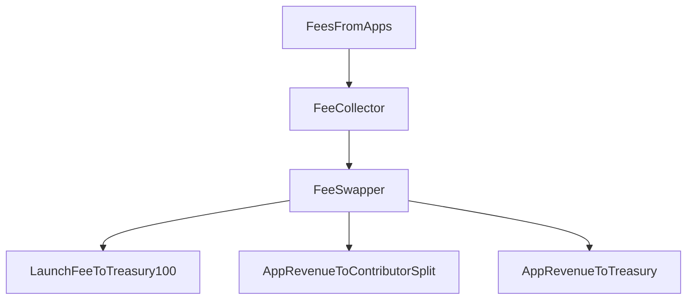

## Overview

The current fee system uses explicit fee kinds and a two-step pipeline:

1. `FeeCollector` records pending balances per app, fee kind, and asset.
2. `FeeSwapper` routes each fee kind according to policy.

No inflation is required for this flow; fees come from protocol usage.

---

## Fee Sources

| Source | Mechanic |
|---|---|
| Launch fee | `10 ELTA`, tagged `LAUNCH_FEE` |
| Curve trading fee | Configured in `AppFeeRouter` (default `1%`) |
| Transfer tax | LP-keyed in `AppToken` (default `1%`, max `2%`) |
| Module fees | `CONTENT_SALE`, `TOURNAMENT_FEE`, `OTHER` |

---

## Routing Policy

### Rules

- `LAUNCH_FEE` routes `100%` to treasury.
- App-revenue fee kinds route to contributor split + treasury.
- Default app-revenue take is `80% contributors / 20% treasury`.
- If app is paused in `AppRegistry`, routing is `100%` treasury.

---

## Worked Example

Assume a curve buy where `actualEltaIn = 1,000` and fee bps is `100`:

| Component | Amount |
|---|---|
| Trade amount | 1,000 ELTA |
| Trading fee | 10 ELTA |
| Fee kind | `TRADING_FEE` |

With default app-revenue routing:

| Recipient | Amount |
|---|---|
| ContributorSplit | 8 ELTA |
| Treasury | 2 ELTA |

Contributors claim from `ContributorSplit` based on configured shares.

---

## Key Defaults

| Metric | Value |
|---|---|
| Launch fee | `10 ELTA` |
| Seed ELTA | `100 ELTA` |
| Curve fee baseline | `1%` |
| Transfer tax baseline | `1%` |
| Launch fee routing | `100% treasury` |
| App-revenue routing default | `80% contributors / 20% treasury` |

---

## Next

<CardGroup cols={2}>
  <Card title="Protocol Overview" icon="diagram-project" iconType="light" href="/learn/protocol-overview">
    Full lifecycle and equations
  </Card>
  <Card title="Launch Guide" icon="rocket" iconType="light" href="/apps/build/launch-your-app">
    Builder launch flow
  </Card>
</CardGroup>
