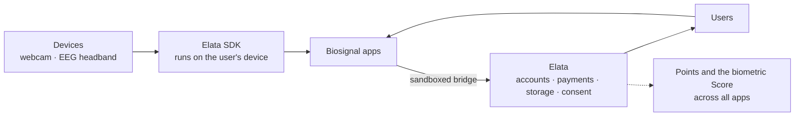

## The big picture

Elata has four layers. Each one has its own section in these docs.

---

## 1. Devices

The sensors are things people already own:

- **A webcam** can estimate pulse from tiny color changes in the skin (remote photoplethysmography, or rPPG).
- **A consumer EEG headband**, such as Muse 2 or Muse S, measures electrical activity from a few points on the scalp, and some models also have an optical (PPG) heart-rate sensor.

See [Devices you can use](/users/devices) and, for the science,
[Biosignals explained](/overview/biosignals).

---

## 2. The Elata SDK

The [Elata SDK](/overview/elata-sdk) is a set of open-source packages that
connect to those devices and turn raw signals into usable measures such as heart
rate, heart-rate variability, and EEG band powers. Processing runs in the
browser, on the user's device, using WebAssembly. Builders use the SDK so they
don't have to write signal processing from scratch.

---

## 3. Apps

Builders combine the SDK with their own ideas: games you steer with focus or
calm, breathwork guides that follow your heart rate, live dashboards, research
tools. Apps are ordinary web apps. See [Apps on Elata](/overview/apps-on-elata).

---

## 4. Elata

[Elata](https://app.elata.bio) is where those apps live. It:

- **Reviews** every release (an automated security scan plus a human moderator)
- **Hosts** each app in an isolated sandbox, so an app can't see who the user is or touch their account
- **Provides** sign-in, purchases, subscriptions, and saved progress, so builders don't have to
- **Asks for consent** in its own interface before any derived result leaves an app

---

## Across all apps

Two things span every app on Elata:

- **[Elata Points](/overview/points)** reward taking part: playing, reviewing, building, and inviting friends.
- **The biometric Score** is an optional, cross-app measure built only from derived session results, and only if the user opts in. See [Privacy and consent](/overview/privacy-and-consent).

---

## How value moves

| Who | Gives | Gets |
| --- | --- | --- |
| Users | Attention, feedback, optional purchases | Apps that respond to their body, with privacy built in |
| Builders | Apps | Distribution, built-in accounts and payments, and revenue from purchases and subscriptions |
| Elata | The platform and the SDK | A one-time registration fee per app and a platform fee on sales and subscriptions |

Details: [Monetization](/overview/monetization).

---

## Where data lives

| Data | Where it stays |
| --- | --- |
| Raw camera frames and biosignals | On the user's device |
| Saves, settings, and scores an app stores | The user's account, scoped to that one app |
| Derived session results for the Score | Shared with Elata only with the user's consent |
| What builders see | Aggregate, anonymized analytics, never individual users |
