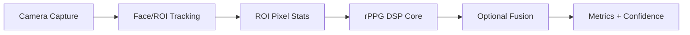

<Info>
  This is an architecture reference, not a tutorial. For integration guidance, see [rPPG In A Browser App](/sdk/guides/rppg-browser) and [rppg-web Getting Started](/sdk/rppg-web/getting-started).
</Info>

## Summary

The rPPG system extracts heart rate and optional ocular features from camera video, then produces calibrated, probabilistic bandpower proxies with confidence scores. A hybrid model keeps capture and vision in JS or native code, while DSP and metrics live in shared Rust/WASM/FFI modules.

---

## Goals

- Single processing core for web, iOS, Android, and desktop
- On-device processing (no raw video leaves the device)
- Stable metrics with explicit confidence and quality gating
- Clear separation between capture/vision and DSP

## Non-Goals

- Replacing clinical EEG or producing diagnostic-grade signals
- Reconstructing full multi-channel EEG from webcam
- Shipping training pipelines in production builds

---

## High-Level Pipeline

1. **Camera capture** via `getUserMedia` (web) or native camera APIs
2. **Face/ROI tracking** using MediaPipe tasks
3. **ROI pixel stats** extracting average RGB and green channel values
4. **rPPG DSP core** with bandpass filtering, temporal normalization, and HR/HRV estimation
5. **Optional fusion** combining ocular features with rPPG signals
6. **Metrics + confidence** for app consumption

---

## Components

### Capture and ROI (Platform-Specific)

| Platform | Capture | Face Detection |
| --- | --- | --- |
| Web | `getUserMedia` | MediaPipe tasks (face/landmarks) |
| iOS / Android | Native camera APIs | Native MediaPipe |

**Output:** timestamped ROI statistics (average R/G/B, quality flags).

### rPPG DSP Core (Shared Rust Module)

The core Rust module consumes `{timestamp, intensity}` samples and runs:

- Temporal normalization
- Bandpass filtering (0.7-4.0 Hz for heart rate)
- Periodogram HR estimation with ACF fallback and harmonic checks

**Output:** `bpm`, `confidence`, `signal_quality`, and optional debug data.

### Ocular Features (Optional)

Optional capture-side features used for fatigue and arousal fusion:

- Blink rate and PERCLOS (percentage of eye closure)
- Gaze stability
- Pupil dynamics

These support fatigue/arousal estimation, not "EEG replacement."

### Fusion and Sentiment (Optional, Modular)

A separate module consuming rPPG + ocular features to produce coarse indices:

- `fatigue_index`
- `arousal_score`
- `focus_proxy`

Can be JS/ONNX or native ML. Kept independent of the rPPG core.

---

## Distribution Strategy

| Target | Approach | Package |
| --- | --- | --- |
| Web | Rust to WASM via the internal `elata-rppg-wasm` crate, wrapped by `rppg-web` for a stable TS API | `@elata-biosciences/rppg-web` |
| Native | Rust to FFI via the internal `elata-rppg-ffi` crate | Internal binding crate |
| Compatibility | Constructors also available through the internal `elata-eeg-wasm` / `elata-eeg-ffi` crates | `@elata-biosciences/eeg-web` |

Camera and MediaPipe stay outside WASM, handled by browser or native APIs.

---

## Quality, Calibration, and Uncertainty

- Always publish a signal quality index (SQI)
- Require per-user baseline (60-120 seconds) for proxy metrics
- Emit confidence or prediction intervals for proxy metrics
- Gate app behavior on SQI and confidence

<Tip>
  For the calibration API that fuses Muse PPG with camera rPPG, see [Calibration and Fusion](/sdk/rppg-web/calibration).
</Tip>

---

## Benchmarking

- Use pyVHR offline for algorithm validation and regression tests
- Compare HR error under motion, lighting, and elevated HR conditions
- Use strict splits (leave-one-subject/context out)

---

## Next

<CardGroup cols={2}>
  <Card title="rPPG Getting Started" icon="heart-pulse" iconType="light" href="/sdk/rppg-web/getting-started">
    Install and use the rPPG package
  </Card>
  <Card title="Calibration and Fusion" icon="bullseye" iconType="light" href="/sdk/rppg-web/calibration">
    Muse PPG calibration models
  </Card>
  <Card title="rPPG Camera Integration" icon="video" iconType="light" href="/sdk/guides/rppg-camera">
    End-to-end webcam pipeline
  </Card>
  <Card title="Frame Sources" icon="camera" iconType="light" href="/sdk/rppg-web/frame-sources">
    MediaPipe face detection
  </Card>
</CardGroup>
