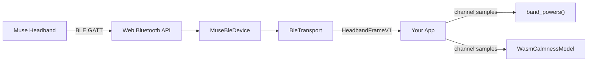

## Overview

This guide walks through the complete flow: initialize WASM, connect to a Muse headband over Web Bluetooth, stream EEG frames, and compute real-time band powers.

---

## Prerequisites

<CodeGroup>

```bash pnpm
pnpm add @elata-biosciences/eeg-web @elata-biosciences/eeg-web-ble
```

```bash npm
npm install @elata-biosciences/eeg-web @elata-biosciences/eeg-web-ble
```

</CodeGroup>

- Chrome/Edge browser with Web Bluetooth support
- A Muse 2 or Muse S headband
- HTTPS or localhost for development

---

## Full Example

```typescript
import { initEegWasm, band_powers, AthenaWasmDecoder } from "@elata-biosciences/eeg-web";
import type { HeadbandFrameV1 } from "@elata-biosciences/eeg-web";
import { BleTransport } from "@elata-biosciences/eeg-web-ble";

// Step 1: Initialize WASM
await initEegWasm();

// Step 2: Create transport with Athena support
const transport = new BleTransport({
  sourceName: "my-app",
  deviceOptions: {
    athenaDecoderFactory: () => new AthenaWasmDecoder(),
    logger: (msg) => console.debug("[BLE]", msg),
  },
});

// Step 3: Handle status changes
transport.onStatus = (status) => {
  const el = document.getElementById("status");
  if (el) el.textContent = status.state;
};

// Step 4: Process incoming frames
transport.onFrame = (frame: HeadbandFrameV1) => {
  const { eeg } = frame;

  // Process each channel
  for (let ch = 0; ch < eeg.channelCount; ch++) {
    const channelSamples = eeg.samples.map(row => row[ch]);
    const powers = band_powers(new Float64Array(channelSamples), eeg.sampleRateHz);

    console.log(`${eeg.channelNames[ch]}: α=${powers.alpha.toFixed(2)} β=${powers.beta.toFixed(2)}`);
  }
};

// Step 5: Connect and stream
try {
  await transport.connect();  // opens Bluetooth picker
  await transport.start();    // begins streaming
} catch (err) {
  console.error("Connection failed:", err);
}
```

---

## Graceful Shutdown

```typescript
async function shutdown() {
  await transport.stop();
  await transport.disconnect();
}

window.addEventListener("beforeunload", shutdown);
```

---

## Handling Reconnection

```typescript
transport.onStatus = (status) => {
  if (status.state === "disconnected" && status.recoverable) {
    console.log("Attempting reconnect...");
    setTimeout(async () => {
      try {
        await transport.connect();
        await transport.start();
      } catch (e) {
        console.error("Reconnect failed:", e);
      }
    }, 2000);
  }
};
```

---

## Architecture



---

## Tips

<Tip>
  Buffer frames for smoother analysis. `band_powers` works best with 1-2 seconds of data (256-512 samples at 256 Hz).
</Tip>

- Use `Float64Array` for best WASM interop performance
- `connect()` triggers a browser-native device picker that the user must interact with
- Test with synthetic data first during development if no headband is available

---

## Next

<CardGroup cols={2}>
  <Card title="EEG Web BLE Reference" icon="bluetooth" iconType="light" href="/sdk/eeg-web-ble/getting-started">
    Transport API and options
  </Card>
  <Card title="Signal Processing" icon="wave-square" iconType="light" href="/sdk/eeg-web/signal-processing">
    Band powers, FFT, spectrum analysis
  </Card>
  <Card title="Headband Transport" icon="signal-stream" iconType="light" href="/sdk/eeg-web/headband-transport">
    Frame schema and transport interface
  </Card>
  <Card title="Troubleshooting" icon="wrench" iconType="light" href="/sdk/operations/troubleshooting">
    Common failures and fixes
  </Card>
</CardGroup>
