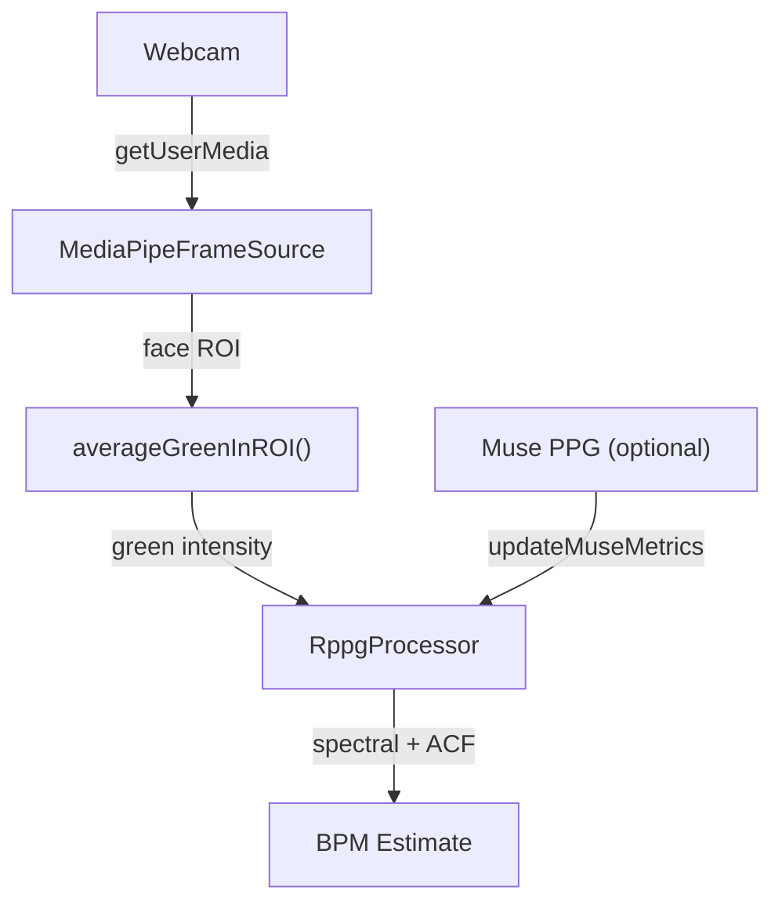

## Overview

This guide walks through the complete rPPG flow: capture webcam frames, detect a face with MediaPipe, extract the green channel from the face ROI, and produce a real-time heart rate estimate.

---

## Prerequisites

<CodeGroup>

```bash pnpm
pnpm add @elata-biosciences/rppg-web
```

```bash npm
npm install @elata-biosciences/rppg-web
```

</CodeGroup>

- Browser with camera access (`getUserMedia`) and WebAssembly support
- HTTPS or localhost for development

---

## Quick Start with DemoRunner

The fastest path uses `DemoRunner` which handles frame capture, face detection, ROI extraction, and processing:

```typescript
import {
  RppgProcessor,
  MediaPipeFrameSource,
  DemoRunner,
} from "@elata-biosciences/rppg-web";

const source = new MediaPipeFrameSource();
const processor = new RppgProcessor("wasm", 30);

const runner = new DemoRunner(source, processor, {
  useSkinMask: true,
  onStats: (stats) => {
    document.getElementById("bpm").textContent =
      processor.getMetrics().bpm?.toFixed(0) || "--";
    document.getElementById("quality").textContent =
      (processor.getMetrics().quality * 100).toFixed(0) + "%";
  },
});

await runner.start();
```

---

## Manual Integration

For full control over the pipeline:

```typescript
import {
  RppgProcessor,
  MediaPipeFaceFrameSource,
  loadFaceMesh,
  averageGreenInROI,
} from "@elata-biosciences/rppg-web";

// Step 1: Load face mesh model
const faceMesh = await loadFaceMesh();

// Step 2: Create frame source with face mesh
const source = new MediaPipeFaceFrameSource(faceMesh);

// Step 3: Create processor
const processor = new RppgProcessor("wasm", 30, 10); // 10s window

// Step 4: Process each frame
source.onFrame = (frame) => {
  if (!frame.roi) return; // no face detected

  const { x, y, w, h } = frame.roi;
  const green = averageGreenInROI(frame, x, y, w, h);

  processor.pushSample(frame.timestampMs ?? performance.now(), green);
};

// Step 5: Start camera
await source.start();

// Step 6: Poll metrics
setInterval(() => {
  const metrics = processor.getMetrics();
  console.log(`BPM: ${metrics.bpm?.toFixed(1)} (quality: ${metrics.quality?.toFixed(2)})`);
}, 1000);
```

---

## With Muse PPG Fusion

If a Muse headband is connected, use its PPG as ground truth to calibrate camera estimates:

```typescript
import { RppgProcessor } from "@elata-biosciences/rppg-web";
import { BleTransport } from "@elata-biosciences/eeg-web-ble";

const processor = new RppgProcessor("wasm", 30);
const transport = new BleTransport();

// Feed Muse PPG data to the processor
transport.onFrame = (frame) => {
  if (frame.ppgRaw) {
    // Extract PPG data and compute BPM from Muse
    const museBpm = /* ... compute from PPG samples ... */;
    processor.updateMuseMetrics(museBpm, 0.9, performance.now());
  }
};
```

---

## Architecture



---

## Tips

<Tip>
  Lighting matters. rPPG works best with even, consistent lighting on the face. Minimize head movement for best signal quality.
</Tip>

- Wait 5-10 seconds for the processor to accumulate a full window of data before producing reliable estimates
- Only display BPM when `metrics.quality` exceeds your threshold (e.g., > 0.5)
- Set `useSkinMask: true` in DemoRunner for better signal extraction

---

## Next

<CardGroup cols={2}>
  <Card title="rPPG Architecture" icon="diagram-project" iconType="light" href="/sdk/guides/architecture-rppg">
    Pipeline design and components
  </Card>
  <Card title="rppg-web Reference" icon="heart-pulse" iconType="light" href="/sdk/rppg-web/getting-started">
    Package API and exports
  </Card>
  <Card title="Calibration and Fusion" icon="bullseye" iconType="light" href="/sdk/rppg-web/calibration">
    Muse PPG calibration models
  </Card>
  <Card title="Frame Sources" icon="camera" iconType="light" href="/sdk/rppg-web/frame-sources">
    MediaPipe face detection
  </Card>
</CardGroup>
