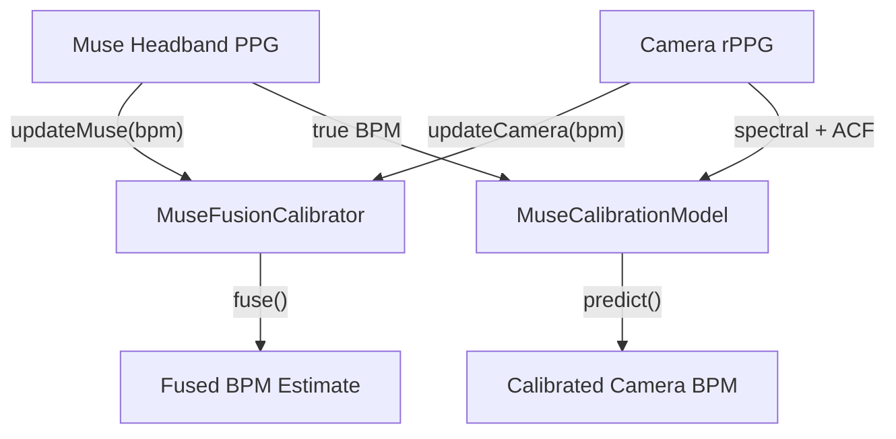

## Overview

When a Muse headband with PPG is available alongside camera-based rPPG, the SDK supports **sensor fusion**, using the contact PPG as a reference to calibrate and improve camera-based heart rate estimates.

---

## MuseFusionCalibrator

Fuses Muse PPG readings with camera rPPG estimates for improved accuracy:

```typescript
import { RppgProcessor, MuseFusionCalibrator } from "@elata-biosciences/rppg-web";

const processor = new RppgProcessor("wasm", 30);
const calibrator = new MuseFusionCalibrator();

// Feed Muse PPG readings (from headband)
calibrator.updateMuse(museBpm, quality, timestampMs);

// Feed camera rPPG readings
calibrator.updateCamera(cameraBpm, cameraQuality, timestampMs);

// Get fused result
const fused = calibrator.fuse(cameraBpm, cameraQuality, timestampMs);
```

The `RppgProcessor` also has a built-in Muse integration:

```typescript
processor.updateMuseMetrics(museBpm, quality, timestampMs);
```

---

## MuseCalibrationModel

A simple regression model that learns the relationship between camera and contact BPM over time:

```typescript
import { MuseCalibrationModel } from "@elata-biosciences/rppg-web";

const model = new MuseCalibrationModel();

// Train with paired observations
model.train(spectralBpm, acfBpm, trueBpm);

// Check if enough data collected
if (model.isTrained()) {
  const predictedBpm = model.predict(spectralBpm, acfBpm);
}

// Persistence
const snapshot = model.getSnapshot();
model.loadSnapshot(snapshot);
model.reset();
```

---

## BPM Evidence Types

The processor produces evidence from multiple analysis methods:

```typescript
type BpmEvidenceSource = "spectral" | "acf" | "tracker" | "muse" | "calibrated";

type BpmEvidence = {
  source: BpmEvidenceSource;
  bpm: number;
  quality: number;
  timestampMs: number;
};

type BpmResolutionResult = {
  bpm: number;
  quality: number;
  source: BpmEvidenceSource;
  evidence: BpmEvidence[];
};

type FusionSource = "camera" | "muse" | "fused";
```

---

## Muse PPG Filter

Apply Muse-style bandpass filtering to PPG samples:

```typescript
import { museStyleFilter } from "@elata-biosciences/rppg-web";

const filtered = museStyleFilter(ppgSamples, sampleRate);
```

---

## Calibration Workflow



1. Start with camera-only rPPG
2. When a Muse headband connects, feed its PPG as ground truth
3. The calibration model learns the camera-to-contact mapping
4. Once trained, camera-only estimates are corrected using the learned model
5. The fusion calibrator combines both sources for maximum accuracy

---

## Next

<CardGroup cols={2}>
  <Card title="Frame Sources" icon="camera" iconType="light" href="/sdk/rppg-web/frame-sources">
    Camera capture and face detection
  </Card>
  <Card title="rPPG Camera Integration" icon="video" iconType="light" href="/sdk/guides/rppg-camera">
    End-to-end webcam pipeline
  </Card>
</CardGroup>
